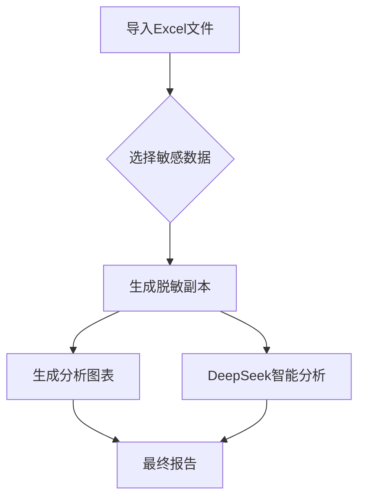

# Excel 数据标注与分析系统（集成 DeepSeek API）

## 系统概述
本文档定义了一个集成 DeepSeek AI 的 Excel 数据处理系统，包含数据脱敏、分析和智能报告生成功能。

## 核心功能
1. 加载 Excel 数据并标注敏感字段（如姓名、身份证号）
2. 生成脱敏数据副本（敏感字段替换为虚拟值）
3. 仅分析非敏感字段并生成可视化图表
4. 调用 DeepSeek API 进行智能分析
5. 合并原始敏感数据生成最终报告

## 实现流程

### 1. 文件导入界面
- 支持多文件批量导入
- 自动读取文件内所有工作表
- 采用与对比工具标签页类似的UI设计

### 2. 敏感数据选择
```python
# 列选择（下拉菜单显示所有列）
sensitive_columns = ["姓名", "身份证号", "手机号"]

# 行选择（可选，需先选择列）
sensitive_rows = [1, 3, 5]  # 可为空列表
```

### 3. 数据处理流程
1. **数据过滤**：排除选定列/行
2. **脱敏处理**：生成脱敏副本
3. **图表生成**：图表可以选择保存至指定目录，同时也可以被DeepSeek形成综合分析报告时直接调用

### 4. 智能分析报告
- 复选框触发 DeepSeek 分析
- 弹出 DeepSeek 交互式对话窗口
- API 配置方式：
  ```python
  # .env 文件配置
  DEEPSEEK_API_KEY=您的API密钥
  DEEPSEEK_BASE_URL=https://api.deepseek.com/v1
  ```

## 参考实现方案

### 1. 安装依赖
```bash
pip install pandas openai xlwings python-dotenv
```

### 2. API 配置模块
```python
import os
from openai import OpenAI
from dotenv import load_dotenv

# 加载环境变量
load_dotenv()
client = OpenAI(
    api_key=os.getenv("DEEPSEEK_API_KEY"),
    base_url="https://api.deepseek.com/***"
)
```

### 3. 数据处理函数
```python
def 数据脱敏(原始df, 敏感列):
    """生成脱敏后的数据副本"""
    脱敏df = 原始df.copy()
    for 列 in 敏感列:
        if 列 in 脱敏df.columns:
            脱敏df[列] = f"[脱敏_{列}]"
    return 脱敏df
```

### 4. DeepSeek 集成模块
```python
def 生成分析报告(数据df, 问题):
    """调用 DeepSeek 生成分析报告"""
    提示词 = f"""
    请分析以下数据：
    {数据df.head().to_markdown()}
    问题：{问题}
    要求：
    - 使用中文回复
    - 分点列出关键发现
    - 标注重要趋势或者异常值
    """
    response = client.chat.completions.create(
        model="deepseek-chat",
        messages=[{"role": "user", "content": 提示词}]
    )
    return response.choices[0].message.content
```

## 典型工作流


## 安全注意事项
1. 严禁提交 `.env` 配置文件
2. 所有分析仅使用脱敏数据
3. 原始数据仅在最终报告合并

## API 文档参考
[DeepSeek 官方API文档](https://api-docs.deepseek.com/zh-cn/)

---

**开发建议**：GUI 界面推荐使用 PyQt 或 Tkinter 实现交互组件